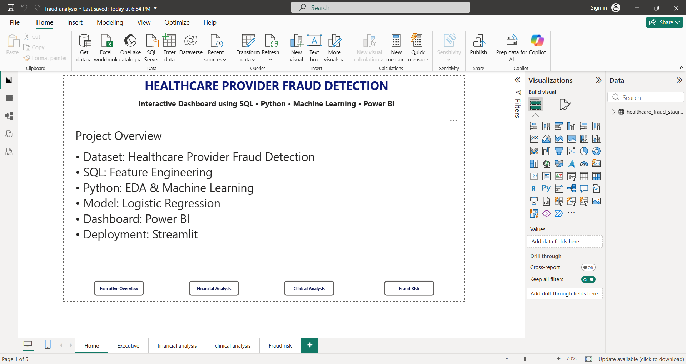
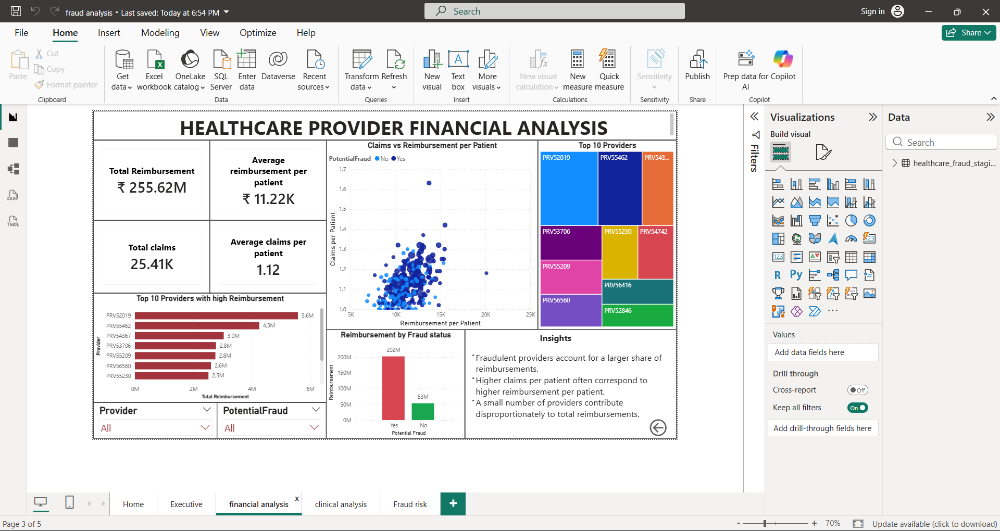
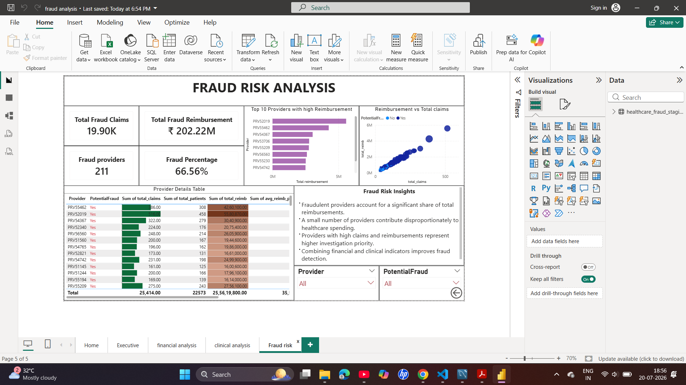

# Healthcare Provider Fraud Detection

A data analytics and machine learning project that identifies potentially fraudulent healthcare providers by analyzing insurance claims data. The project combines SQL for data engineering, Python for exploratory data analysis and predictive modeling, Streamlit for an interactive prediction interface, and Power BI for business intelligence dashboards.

---

## Project Overview

Healthcare insurance fraud increases operational costs and impacts healthcare systems. This project analyzes inpatient and outpatient insurance claims to identify providers with characteristics associated with fraudulent activity.

The workflow includes:

- Data extraction and preprocessing using SQL
- Feature engineering at the provider level
- Exploratory Data Analysis (EDA)
- Machine Learning model development
- Interactive Streamlit application
- Power BI dashboards for business insights

---

## Technologies Used

- SQL (MySQL)
- Python
- Pandas
- NumPy
- Matplotlib
- Scikit-learn
- Streamlit
- Power BI

---

## Dataset

**Dataset:** Healthcare Provider Fraud Detection Analysis

Source:
https://www.kaggle.com/datasets/rohitrox/healthcare-provider-fraud-detection-analysis

The project uses:

- Beneficiary Data
- Inpatient Claims
- Outpatient Claims
- Provider Fraud Labels

A provider-level summary dataset (`provider_summary.csv`) was created using SQL feature engineering and used for machine learning and dashboard development.

---

## Project Workflow

Raw Healthcare Claims Data

↓

SQL Data Cleaning & Feature Engineering

↓

Provider Summary Dataset

↓

Exploratory Data Analysis (EDA)

↓

Machine Learning Model

↓

Streamlit Web Application

↓

Power BI Dashboard

---

## SQL Analysis

Business questions answered include:

- Total providers in the network
- Fraud vs Non-Fraud provider distribution
- Inpatient and outpatient claim analysis
- Provider reimbursement analysis
- Readmission rate analysis
- Chronic disease analysis
- Provider ranking based on reimbursement
- Provider-level feature engineering

---

## Machine Learning

Model Used

- Logistic Regression
- Random Forest (comparison)

Final Model

- Logistic Regression

Performance

- Accuracy: **75%**
- ROC-AUC Score: **0.802**

Features Used

- Total Claims
- Total Patients
- Claims per Patient
- Total Reimbursement
- Average Reimbursement per Patient
- Average Length of Stay
- Readmitted Patients
- Readmission Rate
- Average Chronic Disease Score

---

## Power BI Dashboard

Dashboard Pages

- Home
- Executive Overview
- Financial Analysis
- Clinical Analysis
- Fraud Risk Analysis

Key KPIs

- Total Providers
- Fraud Providers
- Total Claims
- Total Patients
- Total Reimbursement
- Average Length of Stay
- Readmission Rate
- Chronic Disease Score

---

## Streamlit Application

The Streamlit application allows users to enter provider metrics and predicts whether a provider is likely to be associated with potential fraud using the trained Logistic Regression model.

---

## Repository Structure

```
Healthcare-Provider-Fraud-Detection
│
├── Data
│   └── provider_summary.csv
│
├── Images
│
├── PowerBI
│   └── Healthcare_Fraud_Dashboard.pbix
│
├── Python
│   └── Healthcare_Fraud_Detection.ipynb
│
├── SQL
│   ├── 01_create_table.sql
│   ├── 02_load_data.sql
│   ├── 03_analysis_queries.sql
│   └── 04_provider_vummary_view.sql
│
├── Streamlit
│   ├── app.py
│   ├── fraud_model.pkl
│   ├── scaler.pkl
│   └── requirements.txt
│
└── README.md
```
## Dashboard Preview

### Home Page



### Executive Overview


### Financial Analysis



### Clinical Analysis


### Fraud Risk Analysis


---

## Future Improvements

- Deploy the Streamlit application online.
- Add advanced anomaly detection models.
- Include SHAP values for model explainability.
- Integrate real-time healthcare claim monitoring.

---

## Author

**Kalaivani V**

Biomedical Engineering

College of Engineering, Guindy

Anna University

---
